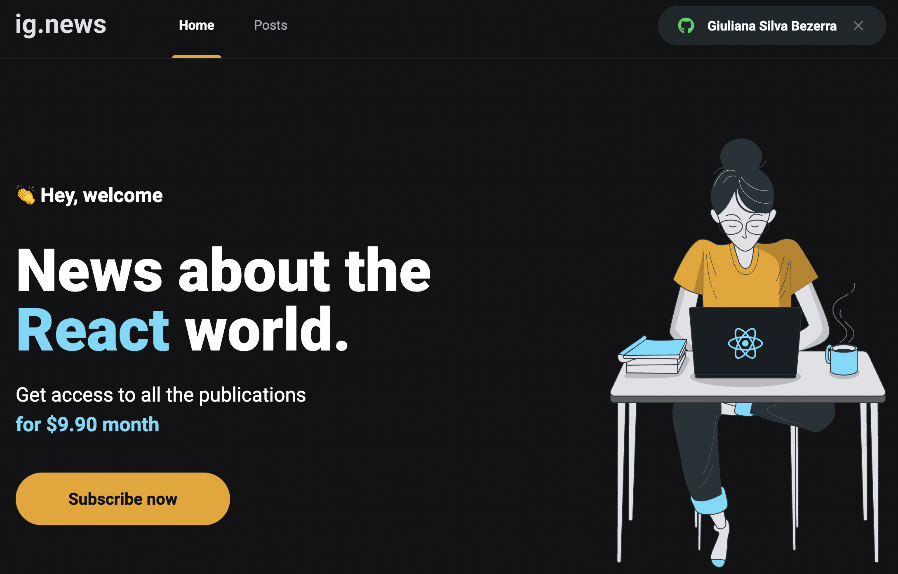

<h1 align="center">
  
</h1>

  <a href="#-tecnologias">Tecnologias</a>&nbsp;&nbsp;&nbsp;|&nbsp;&nbsp;&nbsp;
  <a href="#-projeto">Projeto</a>&nbsp;&nbsp;&nbsp;|&nbsp;&nbsp;&nbsp;
  <a href="#-solução">Solução</a>&nbsp;&nbsp;&nbsp;|&nbsp;&nbsp;&nbsp;
  <a href="#-como-executar">Como executar</a>&nbsp;&nbsp;&nbsp;|&nbsp;&nbsp;&nbsp;
  <a href="#-licença">Licença</a>

  

 

 

## ✨ Tecnologias

Esse projeto foi desenvolvido com as seguintes tecnologias:

- [ReactJS](https://reactjs.org)
- [NextJS](https://nextjs.org/)
- [TypeScript](https://www.typescriptlang.org/)
- [Next-Auth](https://next-auth.js.org/)
- [Stripe](https://stripe.com/)
- [FaunaDB](https://fauna.com/)
- [Prismic CMS](https://prismic.io/)
- [Jest](https://jestjs.io/pt-BR/)

## 💻 Projeto

O ignews é uma aplicação "jamstack" que permite assinar um canal de notícias para ler artigos técnicos.

## 💡 Solução

Nessa aplicação foram explorados vários conceitos importantes:

- [x] Configuração de pagamento com o Stripe
- [x] Utilização de um CMS para exibir os artigos
- [x] Utilização do FaunaDB para salvar os dados de assinaturas dos usuários
- [x] Configuração de autenticação com o Github
- [x] Testes do frontend com o Jest

## 🚀 Como executar

- Clone o repositório
- Instale as dependências com `yarn`
- Crie o seu .env com base no .env.example
- Ouça os eventos do stripe no webhook com `stripe listen --forward-to localhost:3000/api/webhooks --api-key <sua api key>`
- Inicie o servidor com `yarn dev`

Agora você pode acessar [`localhost:8080`](http://localhost:3000) do seu navegador.

## 📄 Licença

Esse projeto está sob a licença MIT.

---
